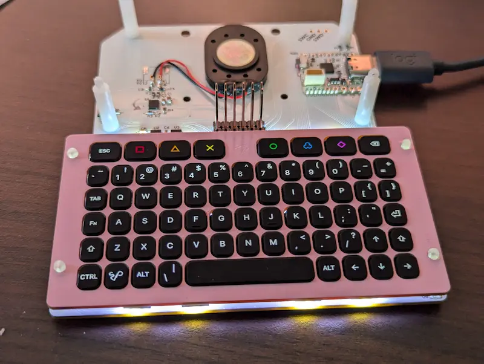

# Fri3d Camp 2024 Badge en Addons

[**Update je Badge!**](onboarding/firstupdate)

Zoek je info voor een van deze borden? Klik dan onmiddellijk door naar die pagina.

## Spelen!

Je moet geen programmeer-goochelaar te zijn om leuke dingen te doen!
Op de [Onboarding](onboarding) pagina zie je de dingen die standaard al ingebouwd zijn. Je kan ook doorklikken naar de [gaming pagina](../Retro--Go-Gaming)

## Programmeren

Je kan jouw badge op verschillende manieren programmeren:

- Je kan **C++** in de [Arduino editor](arduino), of [Visual Studio Code](platformio)
- Wie liever [Python](micropython) programmeert, kan gelijk welke tekst editor gebruiken, maar Visual Studio Code geeft je wel wat extras.
- Om je badge te laten babbelen met je smart home is er [esphome](esphome). Je kan de command line gebruiken of het esphome dashboard.
- Als je liever niet typt, kan je blokjes slepen met [bipes](bipes), een beetje zoals Scratch

## Reset Standaard Firmware

Start je badge niet meer op of wil je terug naar de originele software gaan. Wandel dan even naar de badge / soldeer tent waar je het badge repair station zal vinden. Op deze PC kan je stapsgewijze instructies volgen om alle borden terug te flashen. Of zie [hier hoe je ze zelf kan resetten](reset)

## Documentatie

- [Introductie](https://github.com/Fri3dCamp/badge_2024)
- [De hardware](https://github.com/Fri3dCamp/badge_2024_hw)
- [C++ voorbeelden](https://github.com/Fri3dCamp/badge_2024_arduino)
- [Voorgeïnstalleerde Firmware](https://github.com/Fri3dCamp/badge_2024_micropython)
