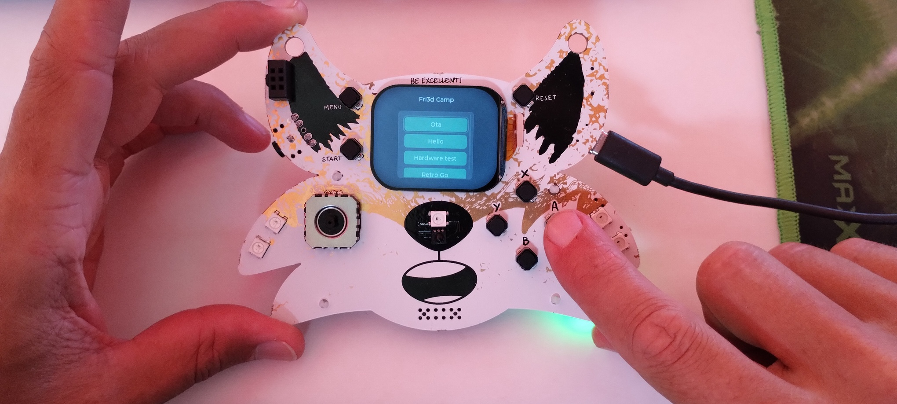
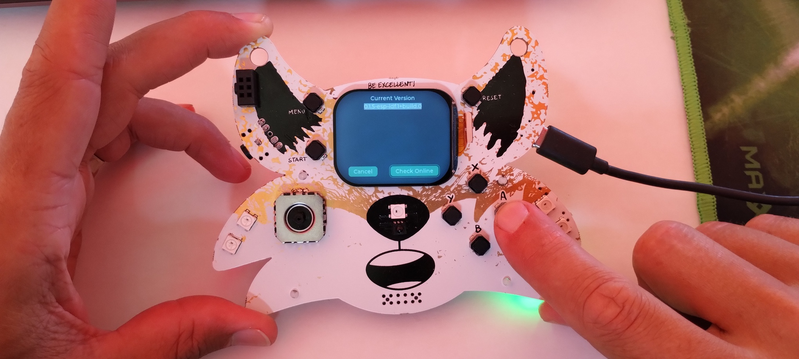
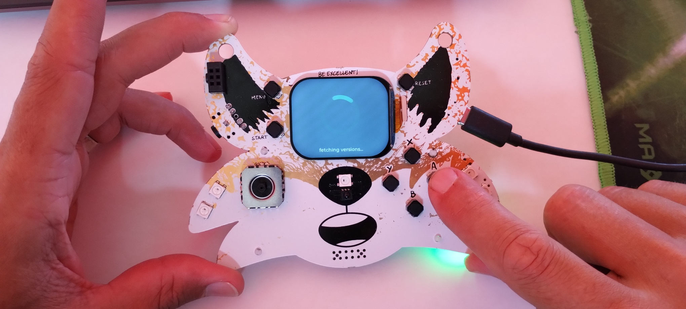
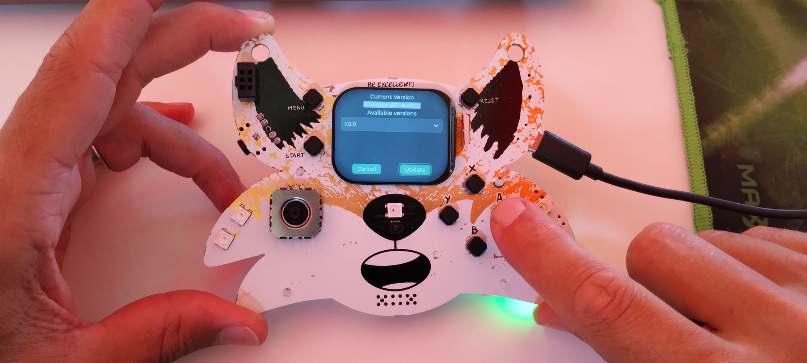
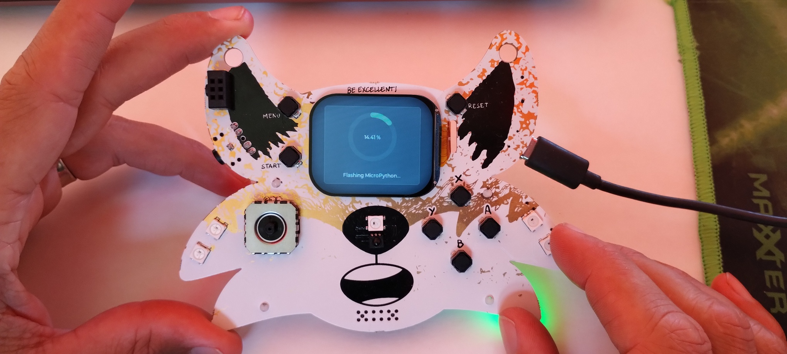
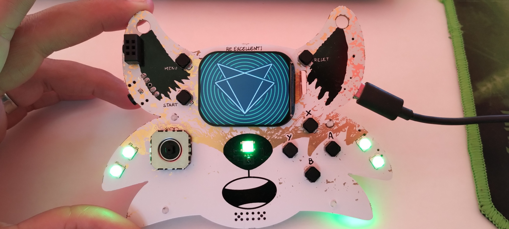
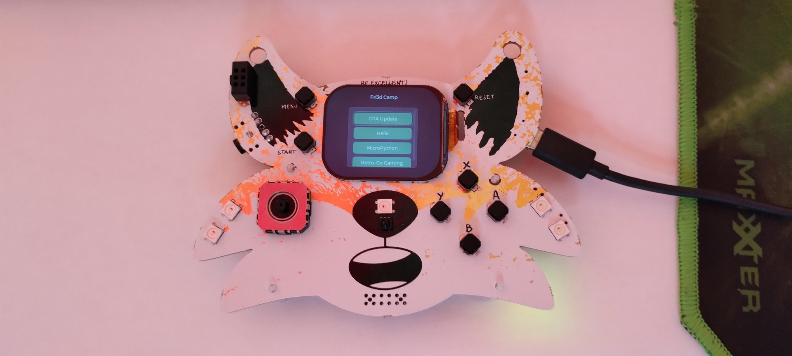

# Je eerste update

Met de meest rechtse schuifschakelaar op de badge, zet je hem aan.

Als je de Fri3d badge voor de eerste keer opstart, kan je "over the air" (OTA) update starten.
Gebruik de "X" en "Y" knoppen om tussen de knoppen op het scherm te wisselen.

gebruik de "X" of "Y" button om te bevestigen dat je online wil gaan. Dit werkt enkel op het Fri3d Camp netwerk.

Selecteer de nieuwste versie -- niewer is altijd beter, niet? ;-)

Er zijn verschillende partities. De badge controleert ze allemaal en zal ze updaten indien nodig. Dit kan even duren.

Na de update herstart de badge automatisch.

Na de update is de optie "hardware test" verdwenen en staat er in de plaats "MicroPython"

Je badge is nu voorzien van de (voorlopig) laatste firmware
